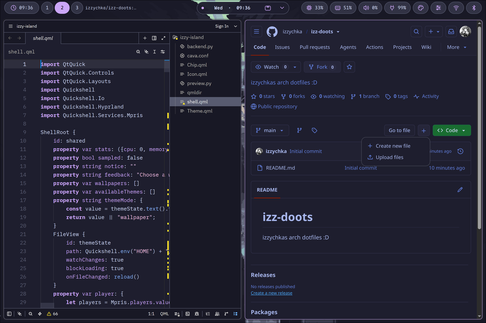
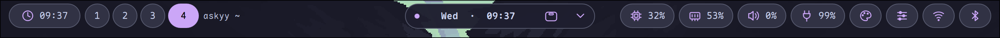
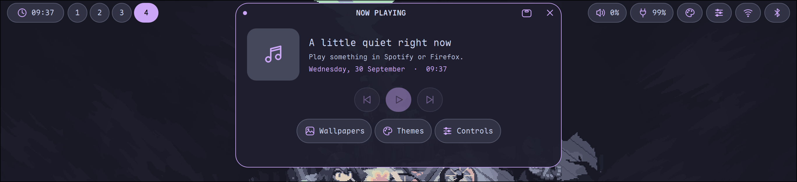
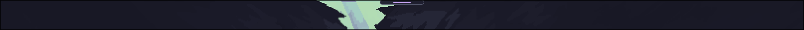
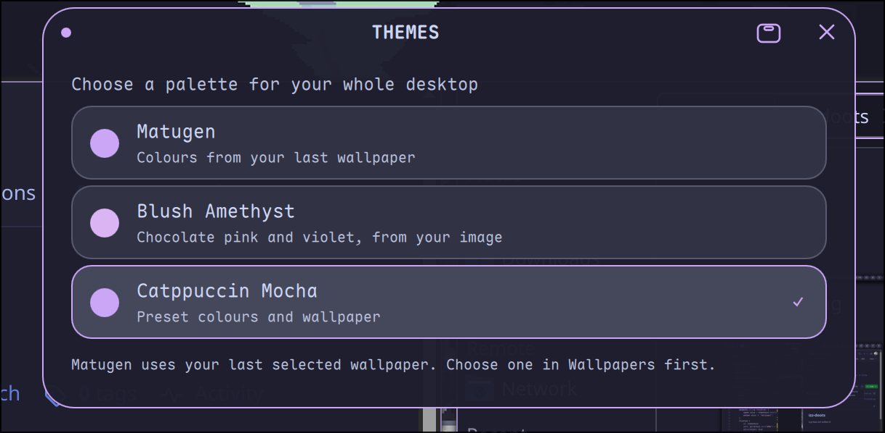
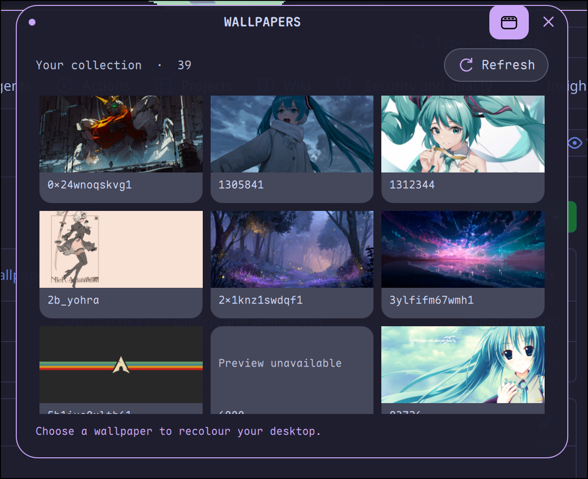
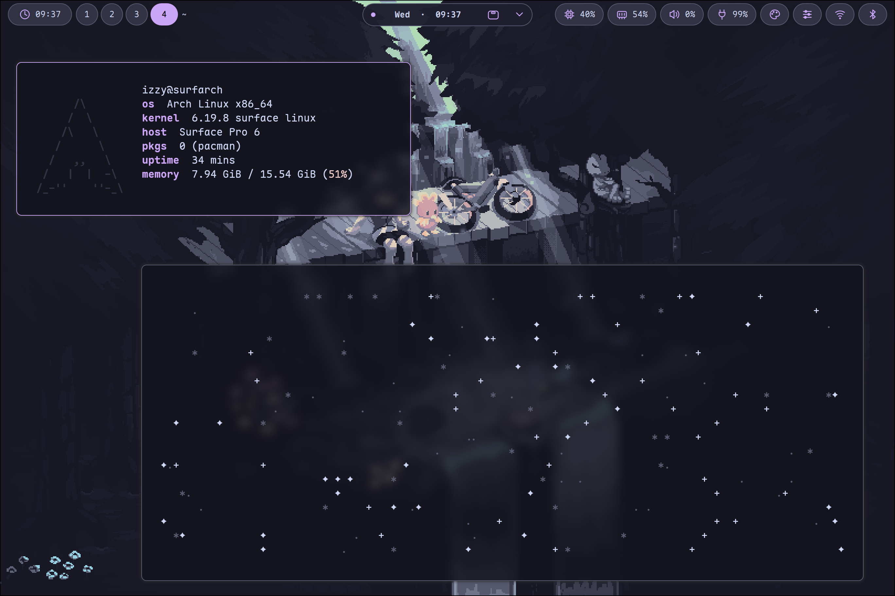

<div align="center">

# izz-doots ✦

**Izzy’s cosy little Arch desktop :3**

Soft colours, little pills, music wiggles, and everything matching your mood.



</div>

## Little things to love ♡

- A dynamic island with song titles, playback controls, and a live music waveform.
- Pick a wallpaper and let **Matugen** find the colours for you.
- Prefer a favourite theme? Pick one and change the colours and wallpaper together.
- Matching terminal, browser, launcher, notifications, editors, and more.
- A lock screen, optional login screen, and support for multiple monitors.

## The island ✧

Keep the full bar, or hide it and let the island peek out when you hover.





## Pick your mood 🌷

Open the island’s theme menu to choose **Catppuccin Mocha, Everforest, Rosé Pine,
Kanagawa Wave, Gruvbox Dark, Coffee Brown, or Blush Amethyst**.

For colours from your wallpaper, choose a wallpaper first, then select **Matugen**.
Add your own pictures to `~/Pictures/wallpapers/`.

| Themes | Wallpapers |
| :---: | :---: |
|  |  |

<details>
<summary>One more desktop peek ✨</summary>



</details>

## Make yourself at home 🐾

You’ll need **Arch Linux**, internet, and **Hyprland 0.55 or newer**.
This sets up your desktop; it doesn’t install Arch for you.

The installer installs the needed apps and saves backups of the settings it replaces.
It’s still being tested, so try it in a virtual machine first and keep a backup of anything important.

Open a terminal and run:

```sh
git clone https://github.com/izzychka/izz-doots.git
cd izz-doots
bash install.sh
```

Run it as your usual user. It will ask for your password when needed.
Once it finishes, log out and choose **Hyprland** when you log back in.

Want to skip the questions? Use `bash install.sh --yes` instead.
Want the matching Pixie login screen too? Use `bash install.sh --sddm`.
You can combine them: `bash install.sh --yes --sddm`.

Some apps still need a little setup, like signing in to Spotify or enabling the
Vesktop theme. Firefox’s Dark Reader colours still need importing manually.
[Extra setup help lives here.](docs/SETUP.md)

## Handy little shortcuts

**Super** is usually the Windows key.

| Press | What happens |
| --- | --- |
| Super + Enter | Open a terminal |
| Super + D | Find an app |
| Super + E | Open your files |
| Super + W | Open qutebrowser |
| Super + L | Lock the screen |
| Super + 1–9 | Switch workspace |
| Super + Q | Close the current window |

## Made with a little help ♡

[Quickshell](https://quickshell.org/) · [Matugen](https://github.com/InioX/matugen) ·
[Pixie by xCaptaiN09](https://github.com/xCaptaiN09/pixie-sddm) (with my added numpad) ·
[Dark Reader](https://darkreader.org/)

Wallpapers and included third-party themes belong to their respective creators.
